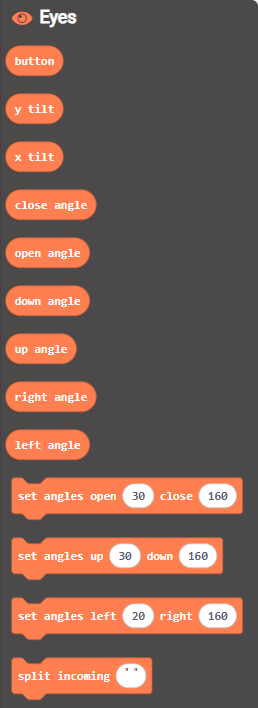

# Think Create Learn Mechanical Eyes Extension
This extension works with the Crickit motor controller board.

> Open this page at [https://lewfer.github.io/mb-eyes/](https://lewfer.github.io/mb-eyes-crikit/)

## Use as Extension

This repository can be added as an **extension** in MakeCode.

* open [https://makecode.microbit.org/](https://makecode.microbit.org/)
* click on **New Project**
* click on **Extensions** under the gearwheel menu
* search for **https://github.com/lewfer/mb-eyes-crikit** and import

## Edit this project 

To edit this repository in MakeCode.

* open [https://makecode.microbit.org/](https://makecode.microbit.org/)
* click on **Import** then click on **Import URL**
* paste **https://github.com/lewfer/mb-eyes-crikit** and click import

## Blocks preview

This image shows the blocks code from the last commit in master.
This image may take a few minutes to refresh.

